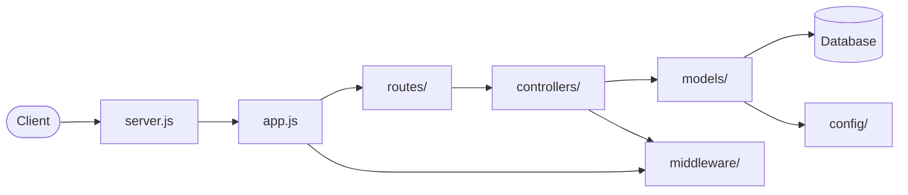

NodeExpress - REST API Backend
Live Demo
https://vercel.com/manibala-sinhas-projects-273c5a77/node-express
Live Demo Build & Deploy a Website with Node.js and Express – Full Step-by-Step Tutorial
https://youtu.be/ne4wsjVzjUk

#  NodeExpress Full-Stack Boilerplate

A clean and scalable **Node.js + Express.js** project following **MVC architecture**.  
Supports MongoDB/PostgreSQL integration, environment configuration, and custom middleware.  
Perfect for REST APIs, microservices, or backend foundations.

---

##  Project Structure

```
/NodeExpress
 ├── server.js        # Start server, load env, run app
 ├── app.js           # Init Express, middleware, routes
 ├── routes/          # Map API endpoints → controllers
 ├── controllers/     # Business logic, call models
 ├── models/          # Schema & DB queries
 ├── config/          # DB connection & env setup
 ├── middleware/      # Auth, error handling, logging
 ├── .env             # Environment variables
 ├── package.json     # Dependencies & scripts
 └── README.md        # Project documentation
```

---

##  Flow Chart



---

##  Request Lifecycle (One-Line per File)

1. **client → server.js**  
   `node server.js` → Starts server, loads `.env`, runs app.

2. **server.js → app.js**  
   `const app = express();` → Initializes Express & middleware.

3. **app.js → routes/**  
   `app.use('/api', userRoutes)` → Mounts API endpoints.

4. **routes/ → controllers/**  
   `router.get('/users', getUsers)` → Maps routes to controllers.

5. **controllers/ → models/**  
   `User.find()` → Runs business logic and queries DB.

6. **models/ → database**  
   `mongoose.model('User', schema)` → Defines schema & queries DB.

7. **app.js & controllers/ → middleware/**  
   `app.use(authMiddleware)` → Auth, error handling, logging.

8. **models/ → config/**  
   `mongoose.connect(DB_URI)` → Connects to DB using env config.

---

##  Tech Stack

- **Runtime:** Node.js  
- **Framework:** Express.js  
- **Database:** MongoDB (Mongoose) / PostgreSQL (Sequelize)  
- **Architecture:** MVC (Model–View–Controller)  
- **Middleware:** Authentication, Error Handling, Logging  
- **Config:** `.env` environment variables  

---

##  Getting Started

### 1. Clone Repository
```bash
git clone https://github.com/ManibalaSinha/NodeExpress.git
cd NodeExpress
```

### 2. Install Dependencies
```bash
npm install
```

### 3. Setup Environment Variables
Create `.env` file:
```env
PORT=5000
DB_URI=mongodb://localhost:27017/mydb
JWT_SECRET=your_secret_key
```

### 4. Run the Server
```bash
npm start
```

Server runs at: `http://localhost:5000`

---

##  Features

- REST API starter with **CRUD support**
- Clean **MVC structure**
- **Database ready** (MongoDB/Postgres)
- **Error handling middleware**
- `.env` based **configuration**
- Production-ready boilerplate

---

##  Topics
`nodejs` · `expressjs` · `restapi` · `mongodb` · `postgresql` · `mvc` · `backend` · `boilerplate`

---

##  Author
Developed by **[Manibala Sinha](https://github.com/ManibalaSinha)**  
Open for collaboration & contributions 
